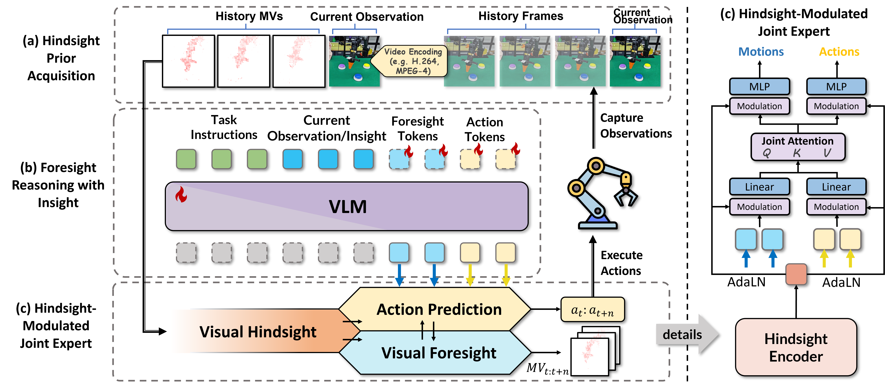

# HiF-VLA: Hindsight, Insight and Foresight through Motion Representation for Vision-Language-Action Models

[]()
[](https://hifvla.github.io/)
[](https://huggingface.co/minnielin/hifvla-libero-long)
[](https://huggingface.co/datasets/minnielin/libero_trajid_rlds)

<br>

<div align="center">
  
</div>

<br>

**HiF-VLA** **(Hindsight, Insight, and Foresight for VLAs)**, a unified framework that leverages motion for bidirectional temporal reasoning. HiF-VLA encodes past dynamics through
hindsight priors, anticipates future motion via foresight reasoning, and integrates both through a hindsight-modulated joint expert to enable “think-while-acting” control.


## 🛠️ Installation

### 1. Clone Repo and Environment Setup

```bash
# Create environment
conda create -n hif-vla python=3.10 -y
conda activate hif-vla

# Install PyTorch
# Use a command specific to your machine: https://pytorch.org/get-started/locally/
pip3 install torch torchvision torchaudio

# Clone hif-vla repo and pip install to download dependencies
git clone https://github.com/minnie-lin/HiF-VLA.git
cd HiF-VLA
pip install -e .

# Install Flash Attention 2 for training (https://github.com/Dao-AILab/flash-attention)
#   =>> If you run into difficulty, try `pip cache remove flash_attn` first
pip install packaging ninja
ninja --version; echo $?  # Verify Ninja --> should return exit code "0"
pip install "flash-attn==2.5.5" --no-build-isolation

```

### 2. Dataset Preparation

- **LIBERO**

  We used a modified version of the LIBERO dataset from [LIBERO](https://huggingface.co/datasets/minnielin/libero_trajid_rlds), where we added trajectory IDs as an additional annotation.
  
  ```bash
  git clone https://github.com/Lifelong-Robot-Learning/LIBERO.git
  pip install -e LIBERO
  pip install -r experiments/robot/libero/libero_requirements.txt  # From vla-adapter base dir
  ```

- **CALVIN**
  
  For the CALVIN ABC→D dataset, we use the rlds version from [calvin_abc_rlds](https://huggingface.co/datasets/zhouhongyi/calvin_abc_rlds).
  ``` bash
  git clone --recurse-submodules https://github.com/mees/calvin.git
  $ export CALVIN_ROOT=$(pwd)/calvin
  $ cd $CALVIN_ROOT
  $ sh install.sh
  ```
- **Get Motion Vectors**
  
  HiF-VLA uses this [tool](https://github.com/LukasBommes/mv-extractor) to extract motion vectors. You need to install [FFMPEG](https://ffmpeg.org/download.html) to support re-encodeing video with MPEG-4 Part 2 codec.
  ``` bash
  # extract motion vectors
  python get_save_motion.py
   --data_root_dir xxx
   --dataset_name libero_10_no_noops
  ```

## 🚀 Inference

Below are the four independently trained HiF-VLA checkpoints for LIBERO and CALVIN ABC->D:
* [hifvla-libero-spatial](https://huggingface.co/minnielin/hifvla-libero-spatial)
* [hifvla-libero-object](https://huggingface.co/minnielin/hifvla-libero-object)
* [hifvla-libero-goal](https://huggingface.co/minnielin/hifvla-libero-goal)
* [hifvla-libero-long](https://huggingface.co/minnielin/hifvla-libero-long)
* [hifvla-calvin-abc](https://huggingface.co/minnielin/hifvla-calvin-abc)


First, download these checkpoints and place them in the ./ckpts/ folder. The directory structure is as below:

``` bash
HiF-VLA
    ├── ckpts
    ·   ├── hifvla-libero-spatial
        ·   ├── lora_adapter (folder)
            ├── action_head.pt
            ├── model-00001-of-00003.safetensors
            └── ...
```

Then, run the commands below to start evaluations with the independently trained checkpoints:

``` bash
# Launch LIBERO evals
bash eval_libero.sh
```

``` bash 
# Launch ABC→D evals
bash eval_calvin.sh
```


## 🚀 Training


First, be sure you have downloaded the LIBERO datasets, as mentioned in the [Data Preparation Section](#data-preparation).

Then, download the [OpenVLA](https://huggingface.co/openvla/openvla-7b/tree/main) foundation models.

Next, launch the fine-tuning script below.

``` bash
bash train.sh
```

Please be sure to test your policy with the same device/GPU used to train it! Otherwise, performance may drop substantially. You may be able to avoid the performance drop if you merge the LoRA weights into the base model on the downstream device used for testing (e.g., if you train on H100 and then merge on A100 before testing on A100). You can see our script [vla-scripts/merge_lora_weights_and_save.py](vla-scripts/merge_lora_weights_and_save.py) for merging the LoRA adapter into the base model offline. It's okay if you already merged LoRA weights into the base OpenVLA model during fine-tuning; you can always redownload the base model and merge again as long as you still have the LoRA adapter (`merge_lora_weights_and_save.py` will handle this for you).

## Acknowledgments

We thank these great works and open-source codebases: [OpenVLA](https://github.com/openvla/openvla.git), [OpenVLA-OFT](https://arxiv.org/abs/2502.19645), [Video-LaViT](https://arxiv.org/abs/2402.03161).
